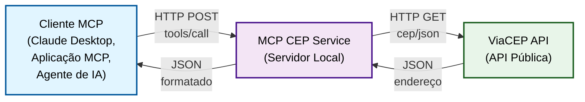
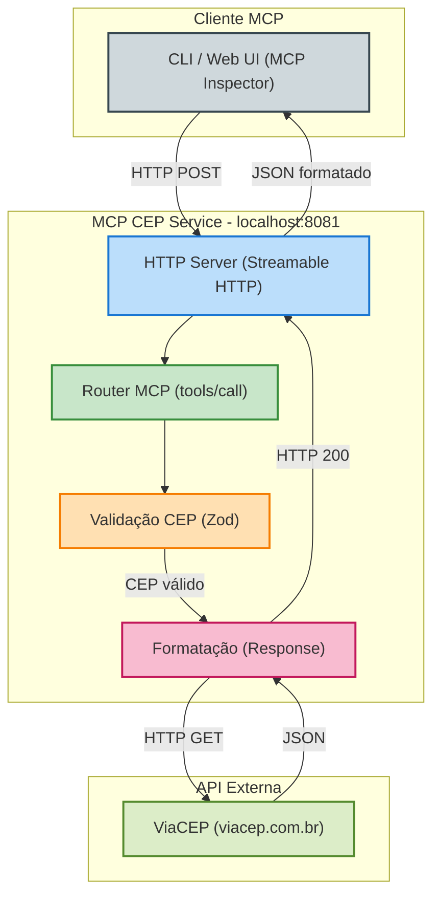
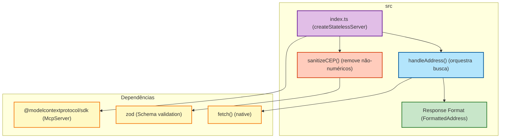

# Arquitetura do MCP CEP Service

## Visão Geral

O **mcp_cep_service** é um servidor **Model Context Protocol (MCP)** stateless que integra clientes agnósticos com a API pública do ViaCEP para busca de endereços brasileiros por CEP.

**Nota:** Para instruções de início rápido, consulte [README.md](./README.md). Este documento aprofunda o design técnico, fluxo de dados e decisões arquiteturais.

## Modelo C4

### Nível 1: Contexto do Sistema



### Nível 2: Container (Componentes do Servidor)



### Nível 3: Componentes (Código-fonte)



## Fluxo de Dados

```
┌─────────────────────────────────────────────────────────────────┐
│ 1. Cliente conecta ao servidor MCP                               │
│    POST http://127.0.0.1:8081/mcp                                │
└─────────────────────────────────────────────────────────────────┘
                              ↓
┌─────────────────────────────────────────────────────────────────┐
│ 2. Cliente enumera ferramentas (tools/list)                     │
│    ✓ Descobre: busca_cep(cep: string)                           │
└─────────────────────────────────────────────────────────────────┘
                              ↓
┌─────────────────────────────────────────────────────────────────┐
│ 3. Cliente chama ferramentas (tools/call)                       │
│    { method: "tools/call", params: { name: "busca_cep",         │
│      arguments: { cep: "06755-260" } } }                         │
└─────────────────────────────────────────────────────────────────┘
                              ↓
┌─────────────────────────────────────────────────────────────────┐
│ 4. Servidor recebe e processa                                    │
│    - sanitizeCEP("06755-260") → "06755260"                       │
│    - Valida com Zod: /^\d{8}$/ ✓                                │
└─────────────────────────────────────────────────────────────────┘
                              ↓
┌─────────────────────────────────────────────────────────────────┐
│ 5. Consulta ViaCEP                                               │
│    GET https://viacep.com.br/ws/06755260/json/                  │
└─────────────────────────────────────────────────────────────────┘
                              ↓
┌─────────────────────────────────────────────────────────────────┐
│ 6. ViaCEP retorna dados brutos                                   │
│    {                                                              │
│      "cep": "06755-260",                                         │
│      "logradouro": "Avenida José André de Moraes",               │
│      "bairro": "Jardim Monte Alegre",                            │
│      "localidade": "Taboão da Serra",                            │
│      "uf": "SP",                                                 │
│      ...                                                          │
│    }                                                              │
└─────────────────────────────────────────────────────────────────┘
                              ↓
┌─────────────────────────────────────────────────────────────────┐
│ 7. Servidor formata resposta                                     │
│    {                                                              │
│      "endereco": "Avenida José André de Moraes, Jardim          │
│                  Monte Alegre, Taboão da Serra - SP",            │
│      "estado": "SP"                                              │
│    }                                                              │
└─────────────────────────────────────────────────────────────────┘
                              ↓
┌─────────────────────────────────────────────────────────────────┐
│ 8. Servidor retorna ao cliente via MCP                           │
│    HTTP 200 OK com resultado formatado                           │
└─────────────────────────────────────────────────────────────────┘
```

## Responsabilidades por Componente

| Componente | Linguagem | Responsabilidade | Tecnologia |
|---|---|---|---|
| **Cliente MCP** | Agnóstico | Conectar ao servidor, enumerar ferramentas, fazer chamadas | MCP (Streamable HTTP) |
| **HTTP Server** | TypeScript | Escutar em `localhost:8081`, rotear requisições MCP | Smithery CLI / Node.js |
| **Validação CEP** | TypeScript | Limpar e validar CEP (8 dígitos numéricos) | Zod |
| **Handler** | TypeScript | Orquestrar chamada a ViaCEP e formatar resposta | fetch() nativo |
| **ViaCEP** | REST API | Fornecer dados de endereço brasileiro por CEP | HTTP GET |

## Statelessness

O servidor **não mantém estado** entre requisições:

- Cada cliente conecta de forma **independente**.
- Sem variáveis globais de sessão.
- Sem cache de endereços.
- Sem fila de requisições.

Isso permite:
- ✅ Múltiplos clientes simultâneos
- ✅ Escalabilidade horizontal (replicar a mesma imagem)
- ✅ Tolerância a falhas (reiniciar sem perder dados)

## Transporte MCP

**Protocolo:** Streamable HTTP  
**Endpoint:** `http://127.0.0.1:8081/mcp`  
**Método:** POST  
**Content-Type:** `application/json`  

Cada requisição MCP é um JSON-RPC 2.0:

```json
{
  "jsonrpc": "2.0",
  "id": 1,
  "method": "tools/call",
  "params": {
    "name": "busca_cep",
    "arguments": {
      "cep": "06755-260"
    }
  }
}
```

## Integração com Agentes de IA

Para usar o servidor em um agente (Claude Desktop, aplicação MCP, etc.):

### 1. Registrar em `~/.claude/mcp.json` (Claude Desktop)

```json
{
  "mcpServers": {
    "cep-service": {
      "command": "http",
      "args": ["http://127.0.0.1:8081/mcp"]
    }
  }
}
```

### 2. Chamar via inspect durante desenvolvimento

```bash
npx @modelcontextprotocol/inspector --transport http --server-url http://127.0.0.1:8081/mcp
```

### 3. Usar em workflow

```
Agente de IA → "Busque o CEP 06755-260" 
           → Chama ferramenta busca_cep 
           → Recebe: { endereco: "...", estado: "SP" }
           → Processa resultado (validar, preencher formulário, etc.)
```

## Decisões de Arquitetura

| Decisão | Justificativa |
|---|---|
| **Stateless** | Simplicidade, escalabilidade, sem lock-in de cliente |
| **Streamable HTTP** | Agnóstico a CLI/Desktop/Web, fácil de testar |
| **Zod para validação** | Type-safe, reutilizável em TypeScript |
| **Sem cache** | ViaCEP é rápido (< 100ms), CEPs são únicos (low cardinality) |
| **Resposta simplificada** | LLMs preferem formato reduzido (4 campos vs. 15 do ViaCEP) |

## Extensibilidade

### Adicionar Novas Ferramentas

Para adicionar uma nova ferramenta ao servidor:

1. **Defina o schema Zod** em `src/index.ts`:
   ```typescript
   const novaTool = z.object({
     parametro: z.string().describe('descrição do parâmetro'),
   });
   ```

2. **Implemente o handler**:
   ```typescript
   async function handleNovaTool(params: z.infer<typeof novaTool>) {
     // lógica aqui
     return { resultado: '...' };
   }
   ```

3. **Registre a ferramenta** no `McpServer`:
   ```typescript
   server.setRequestHandler(ToolCallRequestSchema, async (request) => {
     if (request.params.name === 'nova_tool') {
       const resultado = await handleNovaTool(request.params.arguments);
       return { content: [{ type: 'text', text: JSON.stringify(resultado) }] };
     }
   });
   ```

### Integração com Outras APIs

O servidor atualmente integra apenas ViaCEP. Para adicionar suporte a outras APIs (IBGE, Google Places, etc.):

1. Isole a lógica de integração em um módulo separado
2. Use a mesma estrutura de validação com Zod
3. Mantenha a resposta formatada para LLMs
4. Documente o novo provider em `docs/API.md`

## Limitações e Escopo

### O que o design NÃO suporta

- **Cache de endereços** — Cada requisição consulta ViaCEP diretamente
  - Motivo: CEPs são únicos e ViaCEP responde em <100ms
  - Se necessário: Adicione Redis como middleware

- **Autenticação/Autorização** — Qualquer cliente pode chamar
  - Motivo: Design stateless, sem conceito de usuários
  - Se necessário: Implemente camada de API Gateway

- **Rate limiting integrado** — Delegado ao cliente/proxy
  - Motivo: Mantém servidor simples e agnóstico
  - Se necessário: Use reverse proxy (nginx, Cloudflare)

- **Suporte a múltiplas APIs de CEP** — Apenas ViaCEP
  - Motivo: ViaCEP é rápido e confiável para Brasil
  - Se necessário: Crie um servidor MCP separado

### Futuras Melhorias

- Suporte a busca reversa (endereço → CEP)
- Validação de CEPs quanto a existência antes de chamar ViaCEP
- Métricas e observabilidade (logs estruturados, tracing)
- Suporte a múltiplos idiomas nas mensagens de erro

