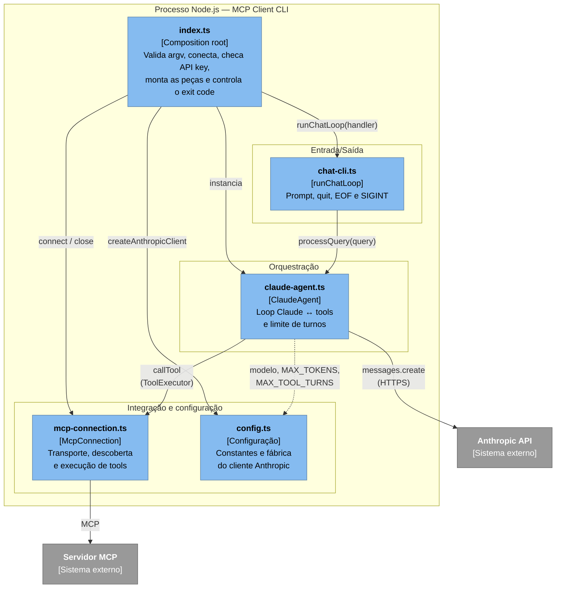
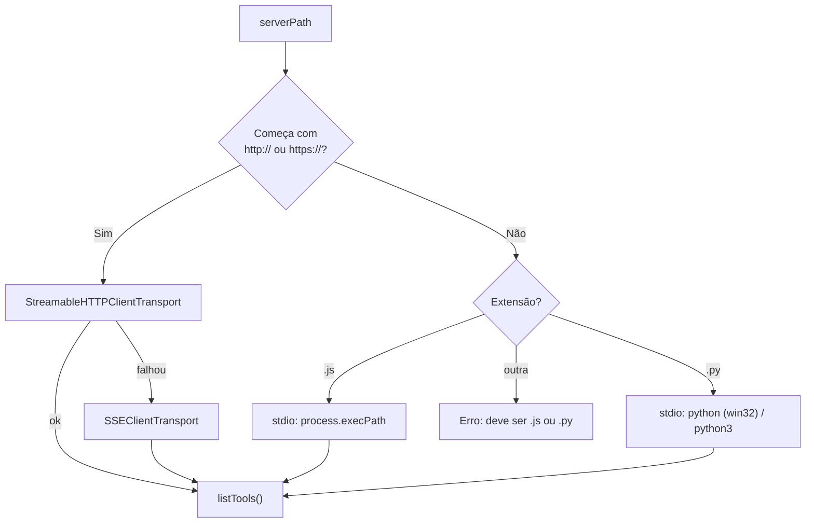
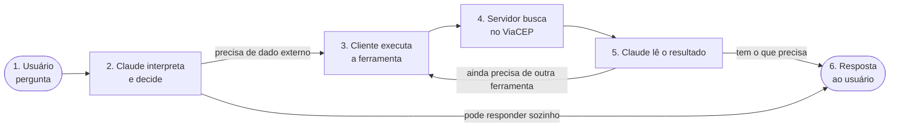
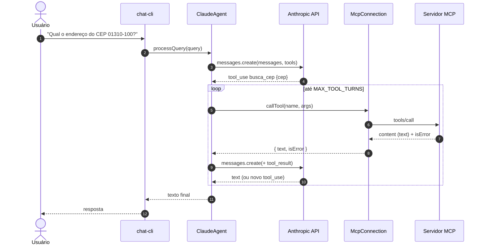

# MCP Client CLI (TypeScript)

Cliente de chat interativo em linha de comando que conecta um servidor **MCP** (Model Context Protocol) ao **Claude**. Ele descobre as ferramentas expostas pelo servidor, entrega-as ao modelo e executa as chamadas de ferramenta que o Claude solicitar enquanto responde às perguntas do usuário.

Neste repositório, o servidor alvo é o **MCP CEP Service** (raiz do repositório), que expõe a ferramenta `busca_cep` sobre a API pública do ViaCEP. O cliente, porém, é agnóstico: funciona com qualquer servidor MCP.

## Índice

- [Pré-requisitos](#pré-requisitos)
- [Configuração](#configuração)
- [Executando](#executando)
- [Arquitetura (C4)](#arquitetura-c4)
- [Estrutura do projeto](#estrutura-do-projeto)
- [Visão funcional de uma consulta](#visão-funcional-de-uma-consulta)
- [Fluxo de uma consulta](#fluxo-de-uma-consulta)
- [Decisões e comportamentos](#decisões-e-comportamentos)
- [Variáveis de ambiente](#variáveis-de-ambiente)

## Pré-requisitos

- Node.js 18+
- npm
- Uma [chave da API Anthropic](https://console.anthropic.com/) (opcional — veja [Executando](#executando))

## Configuração

```bash
npm install
npm run build
cp .env.example .env
# edite .env e configure ANTHROPIC_API_KEY e, opcionalmente, ANTHROPIC_WORKSPACE_ID
```

> **Nota:** se sua chave de API não estiver associada a um workspace, adicione `ANTHROPIC_WORKSPACE_ID` ao `.env`. Você o encontra em https://console.anthropic.com/settings/workspace

## Executando

O argumento é a **URL HTTP** do servidor ou o **caminho de um script** `.js`/`.py` (stdio).

```bash
# Servidor remoto/local via HTTP (StreamableHTTP, com fallback para SSE)
node build/index.js http://127.0.0.1:8081/mcp

# Servidor local iniciado como processo filho via stdio
node build/index.js <caminho/do/servidor>.js
node build/index.js <caminho/do/servidor>.py
```

Inicie o servidor antes (veja o README da raiz do repositório). Digite uma pergunta, por exemplo _"Qual o endereço do CEP 01310-100?"_, e o Claude responde usando as ferramentas do servidor. Digite `quit` (ou Ctrl-D / Ctrl-C) para sair.

Sem `ANTHROPIC_API_KEY`, o cliente ainda se conecta, imprime as ferramentas do servidor e encerra — útil para validar a integração MCP sem credenciais.

## Arquitetura (C4)

### Nível 1 — Contexto do sistema

Quem usa o sistema e com quais sistemas externos ele se integra.


### Nível 2 — Containers

O cliente é um único processo Node.js; os demais containers são os limites de integração.


### Nível 3 — Componentes

Os módulos do processo e suas dependências. A seta de `ClaudeAgent` para `McpConnection` passa pela interface `ToolExecutor`, de modo que o agente não conhece MCP.



### Seleção de transporte (`McpConnection.connect`)



## Estrutura do projeto

```
mcp-client/
├── index.ts                # Entrypoint e composition root
├── src/
│   ├── config.ts           # Constantes e fábrica do cliente Anthropic
│   ├── mcp-connection.ts   # Adapter do SDK MCP (transporte, tools)
│   ├── claude-agent.ts     # Loop de conversa Claude ↔ tools
│   └── chat-cli.ts         # Interface interativa de terminal
├── build/                  # Saída do tsc (gerada, ignorada pelo git)
├── .env.example            # Modelo das variáveis de ambiente
├── package.json            # Dependências e script de build
└── tsconfig.json           # Configuração do TypeScript
```

### Arquivos

| Arquivo | Responsabilidade | Depende de |
|---|---|---|
| [index.ts](index.ts) | Carrega o `.env`, valida argumentos, conecta ao servidor, verifica `ANTHROPIC_API_KEY`, compõe `ClaudeAgent` + `runChatLoop` e garante `close()`/`exit`. Contém apenas orquestração, sem regra de negócio. | todos os módulos de `src/` |
| [src/config.ts](src/config.ts) | Define `ANTHROPIC_MODEL`, `MAX_TOKENS`, `MAX_TOOL_TURNS` e `createAnthropicClient()` (lê `ANTHROPIC_API_KEY` e, se existir, injeta o header `anthropic-workspace-id`). | `@anthropic-ai/sdk` |
| [src/mcp-connection.ts](src/mcp-connection.ts) | Classe `McpConnection`: seleciona o transporte (HTTP com fallback SSE, ou stdio), faz `connect()` + `listTools()`, expõe `callTool()` já normalizado em `{ text, isError }` e `close()`. Isola todo o conhecimento do SDK MCP. | `@modelcontextprotocol/sdk` |
| [src/claude-agent.ts](src/claude-agent.ts) | Classe `ClaudeAgent`: `processQuery()` envia a consulta ao Claude, executa os `tool_use` via `ToolExecutor`, devolve os `tool_result` e repete até haver resposta final ou estourar `MAX_TOOL_TURNS`. Também converte `Tool` MCP em `Anthropic.Tool` (`toAnthropicTools`). | `@anthropic-ai/sdk`, `config.ts` |
| [src/chat-cli.ts](src/chat-cli.ts) | `runChatLoop(handler)`: leitura via `readline`, tratamento de `quit`, EOF (Ctrl-D) e SIGINT, e exibição de erros por consulta sem derrubar o loop. Não conhece Claude nem MCP. | `readline` |
| [.env.example](.env.example) | Modelo do `.env` (`ANTHROPIC_API_KEY`, `ANTHROPIC_WORKSPACE_ID`). | — |
| [package.json](package.json) | Módulo ESM; scripts e dependências (`@anthropic-ai/sdk`, `@modelcontextprotocol/sdk`, `dotenv`). | — |
| [tsconfig.json](tsconfig.json) | `module`/`moduleResolution` `Node16`, `strict`, saída em `build/`. Inclui apenas `index.ts`; os módulos de `src/` entram por importação. | — |

## Visão funcional de uma consulta

Esta seção descreve o fluxo sem entrar em detalhes técnicos: o que o usuário faz, o que o sistema decide e o que volta para a tela. A visão técnica, com componentes e dados trafegados, está em [Fluxo de uma consulta](#fluxo-de-uma-consulta).

### Papéis

| Quem | Papel no fluxo |
|---|---|
| **Usuário** | Faz a pergunta em linguagem natural e lê a resposta. |
| **Cliente (este projeto)** | Intermediário: leva a pergunta ao Claude, executa as ferramentas que o Claude pedir e devolve o resultado. Não interpreta a pergunta nem decide nada sobre o conteúdo. |
| **Claude** | Entende a pergunta, decide se precisa de uma ferramenta, escolhe qual e com quais parâmetros, e redige a resposta final. |
| **Servidor MCP (CEP Service)** | Executa a ferramenta `busca_cep`: valida o CEP, consulta o ViaCEP e devolve o endereço formatado. |

### Visão geral



### Exemplo completo

Os valores abaixo são ilustrativos.

| Etapa | O que acontece, em termos de negócio |
|---|---|
| 1. Pergunta | O usuário digita: _"Qual o endereço do CEP 01310-100?"_ |
| 2. Interpretação | O Claude percebe que não conhece o endereço de memória com segurança e que existe uma ferramenta `busca_cep` para isso. Ele pede ao cliente: _"execute `busca_cep` com o CEP `01310-100`"_. |
| 3. Execução | O cliente repassa o pedido ao servidor e aguarda. O usuário já vê na tela a linha `[Calling tool busca_cep with args {"cep":"01310-100"}]`. |
| 4. Consulta | O servidor remove a formatação (`01310100`), confere que há 8 dígitos, consulta o ViaCEP e responde algo como `{ "endereco": "Avenida Paulista, Bela Vista, São Paulo - SP", "estado": "SP" }`. |
| 5. Redação | O cliente devolve esse resultado ao Claude, que o transforma em uma frase natural. |
| 6. Resposta | O usuário lê, por exemplo: _"O CEP 01310-100 corresponde à Avenida Paulista, bairro Bela Vista, São Paulo - SP."_ |

O terminal mostra, nessa ordem, a linha da chamada da ferramenta e depois a resposta do Claude, juntas em uma única saída.

### Variações do fluxo

| Cenário | O que o usuário vê | Por quê |
|---|---|---|
| Pergunta que não exige ferramenta (_"O que é um CEP?"_) | Resposta direta, sem linha `[Calling tool …]`. | O Claude decide responder sozinho; o servidor MCP nem é acionado. |
| CEP com formato inválido (_"CEP 123"_) | O Claude explica que o CEP precisa ter 8 dígitos e pede um novo valor. | O servidor rejeita a entrada e sinaliza erro; o Claude recebe o erro como informação e o traduz para o usuário. |
| CEP inexistente no ViaCEP | O Claude informa que o endereço não foi encontrado e sugere conferir o número. | O ViaCEP retorna `erro`; o servidor transforma isso em falha da ferramenta. |
| Pergunta com vários CEPs (_"Compare 01310-100 e 20040-020"_) | Uma linha `[Calling tool …]` por consulta, seguida de uma resposta comparando os dois. | O Claude pode pedir mais de uma chamada, em um ou mais turnos, antes de responder. |
| Pergunta que leva a muitas chamadas encadeadas | Resposta parcial terminada em `[Stopped after 10 tool-use turns]`. | Proteção contra laços longos: o cliente para após 10 rodadas de ferramentas. |
| Servidor MCP indisponível ou falha de rede | `Error: <mensagem>` e o prompt volta. | A falha interrompe só aquela consulta; o cliente continua pronto para a próxima. |

### Regras que valem para todo o fluxo

- **Cada pergunta é independente.** O cliente não guarda o histórico entre consultas; _"e o bairro dele?"_ depois de uma pergunta anterior não tem contexto.
- **Quem decide é o Claude.** O cliente nunca escolhe a ferramenta nem os parâmetros; ele só executa o que foi pedido.
- **Falha de ferramenta não derruba a conversa.** Erros chegam ao Claude ou ao prompt como mensagem, e o usuário pode tentar de novo.
- **Sem chave da Anthropic não há conversa.** O cliente apenas conecta ao servidor, lista as ferramentas disponíveis e encerra.

## Fluxo de uma consulta



### Fase 0 — Inicialização (antes da primeira consulta)

Acontece uma única vez em [index.ts](index.ts), antes de o prompt aparecer.

| Etapa | Componente | O que acontece | Dado produzido |
|---|---|---|---|
| a | `index.ts` | `dotenv.config()` carrega o `.env` em `process.env`; `argv[2]` é lido como destino do servidor. | `serverPath` |
| b | `McpConnection.connect` | Escolhe o transporte (HTTP → StreamableHTTP com fallback SSE; `.js`/`.py` → stdio) e abre a sessão MCP. | sessão MCP ativa |
| c | `McpConnection.connect` | `listTools()` pergunta ao servidor quais ferramentas existem. | `Tool[]` do MCP (`name`, `description`, `inputSchema`) |
| d | `index.ts` | Sem `ANTHROPIC_API_KEY`, encerra aqui (já imprimiu as tools). | — |
| e | `config.ts` + `claude-agent.ts` | `createAnthropicClient()` cria o cliente; `toAnthropicTools()` renomeia `inputSchema` → `input_schema`. | `Anthropic.Tool[]` guardado no `ClaudeAgent` |
| f | `chat-cli.ts` | `runChatLoop` recebe `query => agent.processQuery(query)` e abre o prompt. | — |

### Passo a passo de uma consulta

A numeração abaixo é a mesma do diagrama (`autonumber`).

| # | De → Para | Integração | O que trafega | O que o componente faz |
|---|---|---|---|---|
| 1 | Usuário → `chat-cli` | stdin | Texto livre, ex.: `Qual o endereço do CEP 01310-100?` | `rl.question()` lê a linha. `quit` encerra o loop; qualquer outro texto segue. |
| 2 | `chat-cli` → `ClaudeAgent` | chamada em memória | `string` (a consulta) | Delega ao handler `processQuery`. Erros lançados daqui são capturados pelo `chat-cli`, que imprime `Error: …` e volta ao prompt. |
| 3 | `ClaudeAgent` → Anthropic API | HTTPS, Messages API | `model`, `max_tokens`, `messages: [{ role: "user", content: query }]`, `tools` | Abre o histórico da conversa com a consulta e envia junto a definição de todas as tools. |
| 4 | Anthropic API → `ClaudeAgent` | HTTPS | `content[]` com blocos `text` e/ou `tool_use { id, name, input }` | `collectBlocks` separa: blocos `text` vão para `finalText`; blocos `tool_use` viram a lista de chamadas a executar. **Sem `tool_use`, o fluxo salta para o passo 11.** |
| 5 | `ClaudeAgent` → `McpConnection` | chamada em memória (`ToolExecutor`) | `name` e `args` (`input` do modelo, ou `{}`) | Registra `[Calling tool … with args …]` em `finalText` e chama `callTool`. Várias tools do mesmo turno rodam em **sequência**. |
| 6 | `McpConnection` → Servidor MCP | MCP (`tools/call`) via HTTP/SSE/stdio | `{ name, arguments }` | O SDK envia a requisição e valida o resultado contra o schema declarado pela tool. |
| 7 | Servidor MCP → `McpConnection` | MCP | `{ content: [...], isError? }` | Para o CEP Service, o servidor consulta o ViaCEP (`GET /ws/{cep}/json`) e devolve o endereço formatado. |
| 8 | `McpConnection` → `ClaudeAgent` | retorno em memória | `{ text, isError }` | `extractText` junta só os blocos `type: "text"` com `\n`; blocos não textuais (imagem, recurso) são descartados. `isError` vira booleano estrito. |
| 9 | `ClaudeAgent` → Anthropic API | HTTPS | Histórico acrescido de: mensagem `assistant` (o `content` do passo 4) e mensagem `user` com `tool_result { tool_use_id, content, is_error }` | O `tool_use_id` liga cada resultado à chamada que o originou. Todo o histórico é reenviado a cada turno (a API é stateless). |
| 10 | Anthropic API → `ClaudeAgent` | HTTPS | Novo `content[]` | Se vier outro `tool_use`, volta ao passo 5 (próximo turno do loop). Se vier só `text`, segue para 11. |
| 11 | `ClaudeAgent` → `chat-cli` | retorno em memória | `string` | `finalText` (textos do modelo + linhas `[Calling tool …]`) é unido com `\n`. |
| 12 | `chat-cli` → Usuário | stdout | `string` | Imprime a resposta e volta ao prompt (passo 1). |

### Como o estado evolui

O único estado de uma consulta é o array `messages`, local a `processQuery` e descartado ao final. **Não há memória entre consultas**: cada pergunta começa com histórico vazio.

```
Início        [ user: "CEP 01310-100?" ]
Após turno 1  [ user, assistant: tool_use(busca_cep), user: tool_result ]
Após turno 2  [ ..., assistant: text("A Avenida Paulista...") ]   ← resposta final
```

### Condições de término e falhas

| Situação | Onde é tratada | Resultado para o usuário |
|---|---|---|
| Resposta sem `tool_use` | `ClaudeAgent` (passo 4/10) | Texto final normal. |
| Tool retorna `isError: true` | `McpConnection` → `ClaudeAgent` | Repassado ao Claude como `is_error: true`; o modelo decide como explicar ou tentar de novo. |
| Falha de protocolo (servidor caiu, args inválidos, schema violado) | `callTool` lança exceção | Propaga até `chat-cli`, que imprime `Error: <mensagem>`; o prompt continua disponível. |
| Erro da Anthropic API (rede, 4xx/5xx) | `messages.create` lança | Mesmo caminho: `Error: <mensagem>`. |
| `MAX_TOOL_TURNS` (10) atingido com o modelo ainda pedindo tools | `ClaudeAgent` após o loop | Devolve o texto acumulado mais `[Stopped after 10 tool-use turns]`; as tools pendentes não são executadas. |
| `quit`, Ctrl-D (EOF) ou Ctrl-C | `chat-cli` | O loop termina; `index.ts` fecha a conexão MCP e sai com código 0. |

## Decisões e comportamentos

- **Separação de responsabilidades:** entrada/saída (`chat-cli`), orquestração do LLM (`claude-agent`), integração MCP (`mcp-connection`) e configuração (`config`) mudam por motivos distintos e não se conhecem diretamente.
- **Inversão de dependência no agente:** `ClaudeAgent` depende da interface `ToolExecutor` e recebe o cliente Anthropic por construtor, o que permite testá-lo com fakes sem rede.
- **Cliente Anthropic sob demanda:** só é criado depois da checagem da API key, então rodar sem chave não falha no construtor.
- **Limite de turnos:** após `MAX_TOOL_TURNS` (10) idas e voltas, o texto parcial é retornado com o aviso `[Stopped after N tool-use turns]` se o modelo ainda pedir ferramentas.
- **Erros de ferramenta:** `isError` do MCP é repassado ao Claude em `tool_result.is_error`, permitindo que o modelo reaja à falha.
- **Resiliência de transporte:** HTTP tenta StreamableHTTP primeiro (servidores stateless) e cai para SSE.

## Variáveis de ambiente

| Variável | Obrigatória | Descrição |
|---|---|---|
| `ANTHROPIC_API_KEY` | Para conversar com o Claude | Chave da API Anthropic. Sem ela o cliente só lista as tools e sai. |
| `ANTHROPIC_WORKSPACE_ID` | Se a chave não for scoped a um workspace | Enviada no header `anthropic-workspace-id`. |
