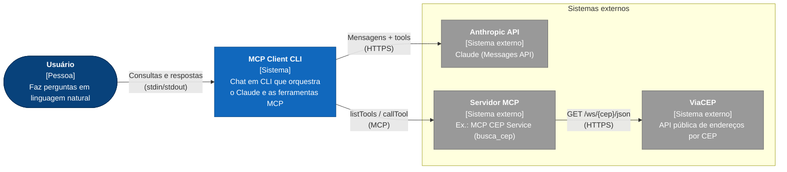
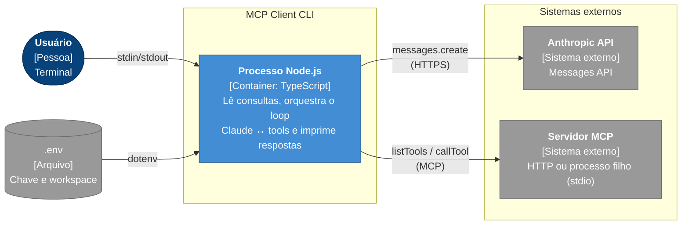
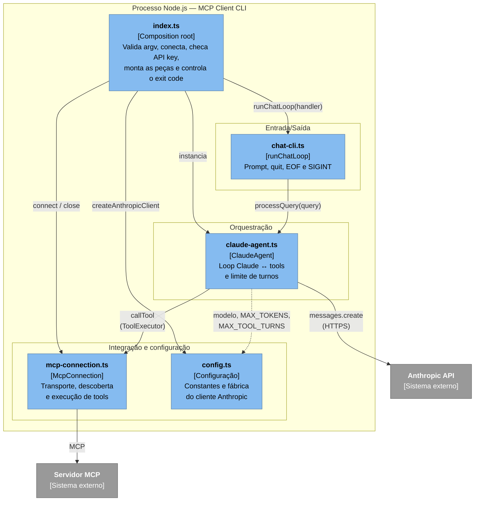
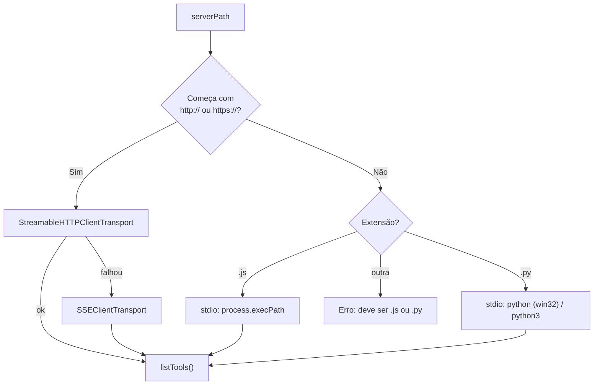
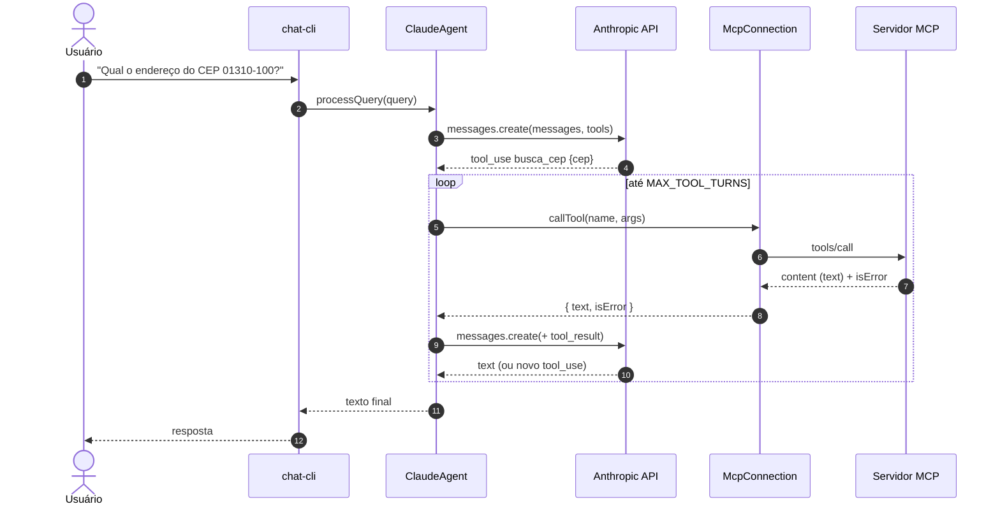

# MCP Client CLI (TypeScript)

Cliente de chat interativo em linha de comando que conecta um servidor **MCP** (Model Context Protocol) ao **Claude**. Ele descobre as ferramentas expostas pelo servidor, entrega-as ao modelo e executa as chamadas de ferramenta que o Claude solicitar enquanto responde às perguntas do usuário.

Neste repositório, o servidor alvo é o **MCP CEP Service** (raiz do repositório), que expõe a ferramenta `busca_cep` sobre a API pública do ViaCEP. O cliente, porém, é agnóstico: funciona com qualquer servidor MCP.

## Índice

- [Pré-requisitos](#pré-requisitos)
- [Configuração](#configuração)
- [Executando](#executando)
- [Arquitetura (C4)](#arquitetura-c4)
- [Estrutura do projeto](#estrutura-do-projeto)
- [Fluxo de uma consulta](#fluxo-de-uma-consulta)
- [Decisões e comportamentos](#decisões-e-comportamentos)
- [Variáveis de ambiente](#variáveis-de-ambiente)

## Pré-requisitos

- Node.js 18+
- npm
- Uma [chave da API Anthropic](https://console.anthropic.com/) (opcional — veja [Executando](#executando))

## Configuração

```bash
npm install
npm run build
cp .env.example .env
# edite .env e configure ANTHROPIC_API_KEY e, opcionalmente, ANTHROPIC_WORKSPACE_ID
```

> **Nota:** se sua chave de API não estiver associada a um workspace, adicione `ANTHROPIC_WORKSPACE_ID` ao `.env`. Você o encontra em https://console.anthropic.com/settings/workspace

## Executando

O argumento é a **URL HTTP** do servidor ou o **caminho de um script** `.js`/`.py` (stdio).

```bash
# Servidor remoto/local via HTTP (StreamableHTTP, com fallback para SSE)
node build/index.js http://127.0.0.1:8081/mcp

# Servidor local iniciado como processo filho via stdio
node build/index.js <caminho/do/servidor>.js
node build/index.js <caminho/do/servidor>.py
```

Inicie o servidor antes (veja o README da raiz do repositório). Digite uma pergunta, por exemplo _"Qual o endereço do CEP 01310-100?"_, e o Claude responde usando as ferramentas do servidor. Digite `quit` (ou Ctrl-D / Ctrl-C) para sair.

Sem `ANTHROPIC_API_KEY`, o cliente ainda se conecta, imprime as ferramentas do servidor e encerra — útil para validar a integração MCP sem credenciais.

## Arquitetura (C4)

### Nível 1 — Contexto do sistema

Quem usa o sistema e com quais sistemas externos ele se integra.



### Nível 2 — Containers

O cliente é um único processo Node.js; os demais containers são os limites de integração.



### Nível 3 — Componentes

Os módulos do processo e suas dependências. A seta de `ClaudeAgent` para `McpConnection` passa pela interface `ToolExecutor`, de modo que o agente não conhece MCP.



### Seleção de transporte (`McpConnection.connect`)



## Estrutura do projeto

```
mcp-client/
├── index.ts                # Entrypoint e composition root
├── src/
│   ├── config.ts           # Constantes e fábrica do cliente Anthropic
│   ├── mcp-connection.ts   # Adapter do SDK MCP (transporte, tools)
│   ├── claude-agent.ts     # Loop de conversa Claude ↔ tools
│   └── chat-cli.ts         # Interface interativa de terminal
├── build/                  # Saída do tsc (gerada, ignorada pelo git)
├── .env.example            # Modelo das variáveis de ambiente
├── package.json            # Dependências e script de build
└── tsconfig.json           # Configuração do TypeScript
```

### Arquivos

| Arquivo | Responsabilidade | Depende de |
|---|---|---|
| [index.ts](index.ts) | Carrega o `.env`, valida argumentos, conecta ao servidor, verifica `ANTHROPIC_API_KEY`, compõe `ClaudeAgent` + `runChatLoop` e garante `close()`/`exit`. Contém apenas orquestração, sem regra de negócio. | todos os módulos de `src/` |
| [src/config.ts](src/config.ts) | Define `ANTHROPIC_MODEL`, `MAX_TOKENS`, `MAX_TOOL_TURNS` e `createAnthropicClient()` (lê `ANTHROPIC_API_KEY` e, se existir, injeta o header `anthropic-workspace-id`). | `@anthropic-ai/sdk` |
| [src/mcp-connection.ts](src/mcp-connection.ts) | Classe `McpConnection`: seleciona o transporte (HTTP com fallback SSE, ou stdio), faz `connect()` + `listTools()`, expõe `callTool()` já normalizado em `{ text, isError }` e `close()`. Isola todo o conhecimento do SDK MCP. | `@modelcontextprotocol/sdk` |
| [src/claude-agent.ts](src/claude-agent.ts) | Classe `ClaudeAgent`: `processQuery()` envia a consulta ao Claude, executa os `tool_use` via `ToolExecutor`, devolve os `tool_result` e repete até haver resposta final ou estourar `MAX_TOOL_TURNS`. Também converte `Tool` MCP em `Anthropic.Tool` (`toAnthropicTools`). | `@anthropic-ai/sdk`, `config.ts` |
| [src/chat-cli.ts](src/chat-cli.ts) | `runChatLoop(handler)`: leitura via `readline`, tratamento de `quit`, EOF (Ctrl-D) e SIGINT, e exibição de erros por consulta sem derrubar o loop. Não conhece Claude nem MCP. | `readline` |
| [.env.example](.env.example) | Modelo do `.env` (`ANTHROPIC_API_KEY`, `ANTHROPIC_WORKSPACE_ID`). | — |
| [package.json](package.json) | Módulo ESM; scripts e dependências (`@anthropic-ai/sdk`, `@modelcontextprotocol/sdk`, `dotenv`). | — |
| [tsconfig.json](tsconfig.json) | `module`/`moduleResolution` `Node16`, `strict`, saída em `build/`. Inclui apenas `index.ts`; os módulos de `src/` entram por importação. | — |

## Fluxo de uma consulta



## Decisões e comportamentos

- **Separação de responsabilidades:** entrada/saída (`chat-cli`), orquestração do LLM (`claude-agent`), integração MCP (`mcp-connection`) e configuração (`config`) mudam por motivos distintos e não se conhecem diretamente.
- **Inversão de dependência no agente:** `ClaudeAgent` depende da interface `ToolExecutor` e recebe o cliente Anthropic por construtor, o que permite testá-lo com fakes sem rede.
- **Cliente Anthropic sob demanda:** só é criado depois da checagem da API key, então rodar sem chave não falha no construtor.
- **Limite de turnos:** após `MAX_TOOL_TURNS` (10) idas e voltas, o texto parcial é retornado com o aviso `[Stopped after N tool-use turns]` se o modelo ainda pedir ferramentas.
- **Erros de ferramenta:** `isError` do MCP é repassado ao Claude em `tool_result.is_error`, permitindo que o modelo reaja à falha.
- **Resiliência de transporte:** HTTP tenta StreamableHTTP primeiro (servidores stateless) e cai para SSE.

## Variáveis de ambiente

| Variável | Obrigatória | Descrição |
|---|---|---|
| `ANTHROPIC_API_KEY` | Para conversar com o Claude | Chave da API Anthropic. Sem ela o cliente só lista as tools e sai. |
| `ANTHROPIC_WORKSPACE_ID` | Se a chave não for scoped a um workspace | Enviada no header `anthropic-workspace-id`. |
